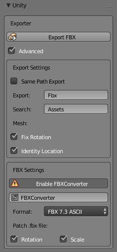
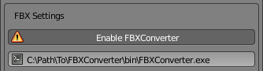

Unity Exporter for Blender
==========================

Blender add-on to correctly export FBX files for Unity, in a non-destructive, hassle free manner.



## Features

- **Auto export to chosen directory:** the add-on uses the object names in Blender for file names, and replicates the folder structure of where the .blend file is located to an export folder:

  ```
  Models
  ├───Blend
  │   └───NPCs
  │           alchemist.blend
  └───Fbx
      └───NPCs
              alchemist.fbx
  ```

- **Export multiple meshes at once:** each selected mesh gets exported to it's own `.fbx` file

  ```
  Models
  ├───Blend
  │   └───NPCs
  │           villagers.blend
  └───Fbx
      └───NPCs
              alchemist.fbx
              guard.fbx
              shopkeeper.fbx
  ```

- **Match Unity's transform:** no need to reset the transform in unity, or change the mesh's import settings

- **Multiple `.fbx` file format options:** including ASCII

## Install

#### Install the Add-on:

1. Download `unity_exporter.py`
2. Open User Preferences in Blender `(File > User Preferences)`
3. In the `Add-ons` tab select `Install Add-on from file...`
4. Select `unity_exporter.py` and enable the add-on

#### Install FBX Converter:

By default the add-on can setup the mesh for Unity, however, using Blender's default FBX Exporter causes the FBX file to have a `-90deg` rotation on the `X axis` and a scale of `100x`.

This requires us to reset the transform in Unity and change the `Scale Factor` to `1` in the `mesh Import Settings`, which can be a mild inconvenience.

To fix this, the add-on can instead use `FBXConverter` to export `.fbx` files, which allows the add-on to patch the file after exporting. This also enables exporting using other FBX formats.

To install FBX Converter:

1. Download [FBXConverter](https://www.autodesk.com/developer-network/platform-technologies/fbx-converter-archives)

2. Add the `bin` directory in the `FBXConverter` install location to `$PATH` environment variable, **or** paste the full location of the `FBXConverter` executable in the `FBXConverter` field in the FBX Settings panel

    

## Configuration

#### Global Settings:

- `Advanced: bool`: Toggle other options (can be disabled to reduce clutter)

#### Export Settings:

- `Same Path Export: bool`: Export to the same directory as the .blend file (instead of using a separate Export directory)
- `Export: string`: Export folder (**Warning:** *this folder must exist with the `Search` folder*)
- `Search: string`: Root folder (the add-on will search for the `Export` folder in this directory)
- `Fix Rotation: bool`: Rotate export mesh by `-90deg` on the `X axis`
- `Identity Location: bool`: Export mesh at origin location `(0, 0, 0)`

#### FBX Settings:

- `Enable FBXConverter: bool`: Enables options that require FBX Converter to be installed
- `FBXConverter: string`: Location of the `FBXConverter` executable
- `Format: enum`: Change FBX file format
- `(Patch) Rotation: bool`: Fix mesh rotation to identity rotation
- `(Patch) Scale: bool`: Fix mesh scaling to use unit scale
